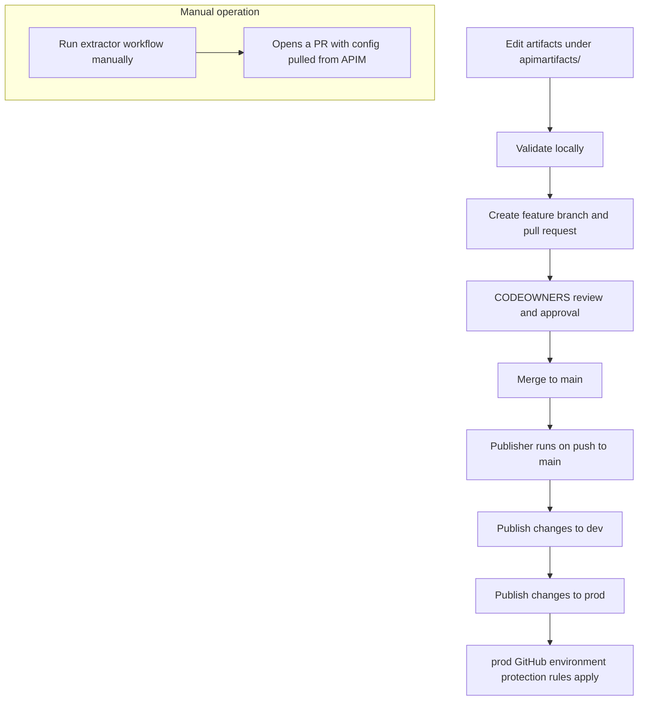
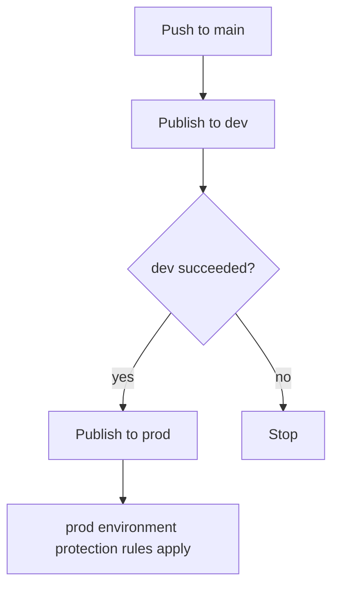

# API Platform – APIOps

This repository is the source of truth for the APIs we publish to **Azure API
Management (APIM)**. Every API — its definition, policies, backends, and
supporting configuration — is stored here as plain files (called *artifacts*)
and managed with **APIOps**: the practice of treating APIM configuration as
code and deploying it through Git and CI/CD.

The flow is simple. You edit artifacts under `apimartifacts/`, validate them
locally, and open a pull request. After review and merge to `main`, a GitHub
Actions pipeline (the **publisher**) applies your changes to the **development**
environment and then to **production**. Day-to-day work needs no manual changes
in the Azure portal.

**New here?** Read the [Overview](#overview) and [How It Works](#how-it-works),
then follow the [Quick Start](#quick-start). Setting up Azure or GitHub for the
first time is an administrator task — see [Administrator Setup](#administrator-setup).

| | |
|---|---|
| **Source of truth** | This repository — the files under `apimartifacts/` |
| **Deployment mechanism** | GitHub Actions running the Azure APIOps publisher (v7.0.4) |
| **Environments** | `dev` (development) and `prod` (production) |
| **Primary artifact location** | `apimartifacts/` |
| **Main branch behavior** | Every push to `main` publishes to dev, then prod |

## Table of Contents

- [Overview](#overview)
- [How It Works](#how-it-works)
- [Repository Structure](#repository-structure)
- [APIOps Artifact Model](#apiops-artifact-model)
- [Prerequisites](#prerequisites)
- [Quick Start](#quick-start)
- [Adding a New API](#adding-a-new-api)
- [Configuring an API](#configuring-an-api)
- [Environment Configuration](#environment-configuration)
- [Deployment and Promotion](#deployment-and-promotion)
- [Extracting APIM Configuration](#extracting-apim-configuration)
- [Local Validation](#local-validation)
- [Pull Request and Review Process](#pull-request-and-review-process)
- [Ownership and Responsibilities](#ownership-and-responsibilities)
- [Security Guidelines](#security-guidelines)
- [Troubleshooting](#troubleshooting)
- [Administrator Setup](#administrator-setup)
- [Common Tasks](#common-tasks)
- [Glossary](#glossary)
- [Additional Documentation](#additional-documentation)

## Overview

Managing APIM by hand in the Azure portal does not scale. Changes are hard to
review, easy to forget, and drift between environments over time. This
repository solves that by keeping every APIM setting in version control, where
changes are reviewed, traceable, and promoted the same way through every
environment.

In this repository, **APIOps** means:

- APIM configuration is expressed as files (artifacts) under `apimartifacts/`.
- Changes go through pull requests and code review.
- The **publisher** applies artifacts to APIM; the **extractor** reads an
  existing APIM instance back into artifacts.

**What is managed here:** APIs and their OpenAPI specifications, API-level and
operation-level policies, backends, named values, policy fragments, tags, and
per-environment overrides.

**What you should not change manually in the Azure portal:** anything that is
represented as an artifact in this repository. Manual portal edits are not
tracked and will drift from — or be overwritten by — the next publish. If a
change was already made in the portal, use the extractor to bring it back into
source control rather than editing both places.

**Responsibilities** are defined in
[.github/CODEOWNERS](.github/CODEOWNERS). `CODEOWNERS` sets who is auto-requested
to review each path; it does not block merges on its own. Making those reviews
mandatory before merge is done with GitHub branch protection or repository
rulesets (see [Pull Request and Review Process](#pull-request-and-review-process)).

- **Application teams** own their own API folder: `apimartifacts/apis/<api>/`
  (specification, API information, and operation policies).
- **Platform team** owns shared and higher-risk areas: `backends/`,
  `named values/`, `policy fragments/`, `tags/`, `configuration.prod.yaml`,
  the pipelines under `.github/`, and `tools/`.

## How It Works

The end-to-end lifecycle:

1. A developer creates or updates API artifacts under `apimartifacts/`.
2. The developer validates the changes locally with the
   **APIOps: Validate artifacts** task (or the underlying script).
3. The developer creates a feature branch and opens a pull request.
4. `CODEOWNERS` automatically requests the right reviewers, who approve.
5. The pull request is merged into `main`.
6. The push to `main` triggers the **publisher**, which applies the changed
   artifacts to **dev**.
7. After the dev job succeeds, the publisher applies the same changes to
   **prod**. The prod job runs in the `prod` GitHub environment, so any
   protection rules configured there (for example required reviewers) apply
   before it proceeds.
8. When configuration was changed directly in APIM, the **extractor** is run
   manually to pull that configuration back into the repository as a pull
   request.



Under the hood, the workflows download the official
[Azure/APIOps](https://github.com/Azure/apiops) publisher and extractor
binaries (pinned to `v7.0.4`) and run them against APIM using a service
principal stored in GitHub environment secrets. On a push, the publisher runs
against the pushed commit, so it processes the artifacts changed in that commit;
a manual run can instead republish everything (see
[Deployment and Promotion](#deployment-and-promotion)).

## Repository Structure

This is the full layout. Every folder is explained in the tables below.

```text
apiops-infy-poc/
├─ apimartifacts/                     # Source of truth — everything published to APIM
│  ├─ apis/                           # One folder per API
│  │  └─ swagger-petstore/            # Reference example — copy this pattern
│  │     ├─ apiInformation.json       # API name, URL path, service URL
│  │     ├─ specification.json        # OpenAPI/Swagger definition
│  │     ├─ policy.xml                # API-level policy
│  │     └─ operations/               # One folder per operation (name = operationId)
│  │        └─ getPetById/policy.xml  # Operation-level policy
│  ├─ backends/                       # Named backend targets (absolute URLs)
│  ├─ named values/                   # Reusable/secret settings used in policies
│  ├─ policy fragments/               # Reusable policy snippets
│  └─ tags/                           # Labels that group and govern APIs
├─ .github/
│  ├─ workflows/                      # CI/CD pipelines (publisher, extractor)
│  ├─ CODEOWNERS                      # Review ownership per folder
│  └─ pull_request_template.md        # PR checklist
├─ docs/                              # One-time administrator setup guides
├─ tools/
│  └─ scripts/                        # Local scaffold + validation scripts
├─ .vscode/
│  └─ tasks.json                      # VS Code task shortcuts for the scripts
├─ configuration.prod.yaml            # Production overrides
├─ configuration.extractor.yaml       # Extractor input configuration
└─ readme.md
```

- **`apimartifacts/`** — the source of truth. Every file here describes part of
  APIM and is what the publisher applies. Application teams work under
  `apimartifacts/apis/<api>/`; the platform team owns the shared folders.
- **`.github/workflows/`** — the CI/CD pipelines: `run-publisher.yaml` (entry
  point on push), `run-publisher-with-env.yaml` (reusable job that runs the
  publisher for one environment), and `run-extractor.yaml` (manual extractor).
- **`docs/`** — one-time administrator setup guides for provisioning Azure and
  configuring GitHub environments. Application teams rarely touch these.
- **`tools/`** — local helper scripts to scaffold a new API and to validate
  artifacts before opening a pull request.
- **`.vscode/`** — editor convenience. `tasks.json` exposes the scripts as
  Run Task menu entries.
- **Environment configuration files** — `configuration.prod.yaml` holds
  production overrides applied by the publisher for prod;
  `configuration.extractor.yaml` lists what the extractor should pull when run
  in filtered mode.

## APIOps Artifact Model

All artifacts live under `apimartifacts/`. The publisher creates or updates the
matching APIM resources from these files.

| Artifact | What it represents | Where it is stored | Normally maintained by |
|---|---|---|---|
| API | A published API in APIM | `apis/<api>/` | Application team |
| API information | The API's core settings (display name, path, `serviceUrl`, protocols) | `apis/<api>/apiInformation.json` | Application team |
| OpenAPI specification | The API contract (operations, schemas) | `apis/<api>/specification.json` or `.yaml` | Application team |
| API-level policy | Rules applied to the whole API | `apis/<api>/policy.xml` | Application team |
| Operation-level policy | Rules for a single operation | `apis/<api>/operations/<operationId>/policy.xml` | Application team |
| Backend | A named destination requests are forwarded to | `backends/<backend>/backendInformation.json` | Platform team |
| Named value | A reusable/secret setting referenced in policies as `{{name}}` | `named values/<name>/namedValueInformation.json` | Platform team |
| Policy fragment | A reusable policy snippet shared across APIs | `policy fragments/<fragment>/` | Platform team |
| Tag | A label used to group and govern APIs | `tags/<tag>/` | Platform team |

Key rules and relationships:

- **Operation folder names must match OpenAPI `operationId` values.** If the
  specification defines `"operationId": "getOrder"`, the policy folder must be
  `operations/getOrder/`. This is required by the APIOps structure and is part
  of the pull request checklist.
- **A tag is applied to an API** by adding
  `tags/<tag>/apis/<api>/tagApiInformation.json` (an empty `{}` file is enough).
- **A policy references a named value or fragment by name**, so the referenced
  artifact must exist in the target APIM before the policy that uses it.

Four related concepts are easy to confuse — keep them distinct:

- **Backend resource** (`backends/<name>/…`) — a named routing target. Its
  `url` must be a **literal absolute URL**; APIM does not resolve `{{token}}`
  values in a backend `url`. A policy selects it with
  `<set-backend-service backend-id="<name>" />`.
- **API `serviceUrl`** (`apiInformation.json`) — the default backend address
  for the API when no backend is selected in policy.
- **Named value** — a value referenced inside policies as `{{name}}`. Named
  values can be overridden per environment.
- **Environment-specific override** (`configuration.prod.yaml`) — where values
  that differ in production (such as a backend `url` or an API `serviceUrl`)
  are set, instead of hard-coding them in the artifacts.

## Prerequisites

Application teams need Git, Visual Studio Code, and PowerShell 7. Azure CLI is
only required for administrators performing first-time setup.

| Tool | Who needs it | Purpose | Verify | Install |
|---|---|---|---|---|
| Git | Everyone | Clone the repository and push branches | `git --version` | <https://git-scm.com> |
| Visual Studio Code | Everyone | Edit artifacts and run the built-in tasks | `code --version` | <https://code.visualstudio.com> |
| PowerShell 7 (`pwsh`) | Everyone | Run the scaffold and validation scripts | `pwsh --version` | <https://aka.ms/powershell> |
| Azure CLI | Administrators | Provision Azure resources during setup | `az --version` | <https://aka.ms/azcli> |

## Quick Start

This is the fastest path from an empty checkout to an open pull request. It uses
a generic example API named `orders-api`; substitute your own values.

1. Clone the repository.

   ```bash
   git clone <repository-url>
   cd apiops-infy-poc
   ```

2. Create a feature branch.

   ```bash
   git checkout -b feature/orders-api
   ```

3. Open the repository in VS Code.

   ```bash
   code .
   ```

4. Scaffold the API skeleton. Run the VS Code task
   **Terminal → Run Task… → `APIOps: Add new API`** (it prompts for the API name
   and dev backend URL), or run the script directly:

   ```powershell
   pwsh -File tools/scripts/New-ApiScaffold.ps1 `
     -ApiName orders-api `
     -DisplayName "Orders API" `
     -Path orders `
     -BackendUrl https://orders-api.dev.example.com `
     -Operations getOrder,createOrder `
     -Tags partner
   ```

5. Add the OpenAPI specification at
   `apimartifacts/apis/orders-api/specification.json` (or `.yaml`). The scaffold
   does not create it.

6. Adjust the generated policies, backend, named value, and tags as needed.

7. Validate locally. Run the VS Code task **`APIOps: Validate artifacts`**, or:

   ```powershell
   pwsh -File tools/scripts/Validate-Artifacts.ps1
   ```

8. Review the changes.

   ```bash
   git status
   git diff
   ```

9. Commit and push.

   ```bash
   git add .
   git commit -m "Add orders-api"
   git push -u origin feature/orders-api
   ```

10. Open a pull request against `main`. After review and merge, the publisher
    deploys to dev and then prod.

## Adding a New API

Use the scaffold script (directly or via the `APIOps: Add new API` task) to
generate a standards-compliant skeleton.

Parameters of `tools/scripts/New-ApiScaffold.ps1`:

| Parameter | Required | Purpose |
|---|---|---|
| `-ApiName` | Yes (prompted if omitted) | URL-safe API name; used as the folder and APIM name |
| `-DisplayName` | No | Human-friendly name; defaults to `-ApiName` |
| `-Path` | No | API URL suffix in APIM; defaults to `-ApiName` |
| `-BackendUrl` | Yes (prompted if omitted) | Dev backend URL; stored in the backend and its named value |
| `-Operations` | No | Comma-separated `operationId`s to scaffold operation policies for |
| `-Tags` | No | Comma-separated tag names to create and link |
| `-ArtifactsRoot` | No | Artifacts root folder; defaults to `apimartifacts` |

Files generated for
`-ApiName orders-api -Operations getOrder,createOrder -Tags partner`:

```text
apimartifacts/apis/orders-api/apiInformation.json
apimartifacts/apis/orders-api/policy.xml
apimartifacts/apis/orders-api/operations/getOrder/policy.xml
apimartifacts/apis/orders-api/operations/createOrder/policy.xml
apimartifacts/backends/orders-api-backend/backendInformation.json
apimartifacts/named values/orders-api-backend-url/namedValueInformation.json
apimartifacts/tags/partner/tagInformation.json
apimartifacts/tags/partner/apis/orders-api/tagApiInformation.json
```

The script skips files that already exist, so it is safe to re-run. It does not
generate `specification.json` — add that yourself. The repository also includes a
complete sample API under `apimartifacts/apis/swagger-petstore/` you can copy.

## Configuring an API

A working set for the `orders-api` example.

API information — `apimartifacts/apis/orders-api/apiInformation.json`:

```json
{
  "properties": {
    "apiRevision": "1",
    "displayName": "Orders API",
    "path": "orders",
    "protocols": [ "https" ],
    "serviceUrl": "https://orders-api.dev.example.com",
    "subscriptionRequired": true
  }
}
```

API-level policy — `apimartifacts/apis/orders-api/policy.xml`:

```xml
<policies>
  <inbound>
    <base />
    <include-fragment fragment-id="correlation-id" />
    <set-backend-service backend-id="orders-api-backend" />
  </inbound>
  <backend>
    <forward-request />
  </backend>
  <outbound>
    <base />
    <set-header name="X-Owner-Team" exists-action="override">
      <value>api-platform</value>
    </set-header>
  </outbound>
  <on-error>
    <base />
  </on-error>
</policies>
```

Backend — `apimartifacts/backends/orders-api-backend/backendInformation.json`.
Use a literal absolute URL; APIM does not resolve `{{token}}` values in a backend
`url`. Per-environment differences are handled by an override, not a token:

```json
{
  "properties": {
    "description": "Orders API backend.",
    "protocol": "http",
    "url": "https://orders-api.dev.example.com"
  }
}
```

Keep these four concepts distinct:

- **Backend resource** — a named routing target selected with
  `<set-backend-service backend-id="orders-api-backend" />`. Its `url` must be a
  literal absolute URL.
- **API `serviceUrl`** — the default backend address used when no backend is
  selected in policy.
- **Named value** — a value referenced inside policies as `{{name}}`; it can be
  overridden per environment.
- **Environment override** — the place to set values that differ per environment
  (see [Environment Configuration](#environment-configuration)).

## Environment Configuration

Two kinds of configuration control how a deployment behaves.

Per-environment artifact overrides live in `configuration.prod.yaml`. The
publisher applies these on top of the artifacts when deploying to prod. Match
resources by `name` and override only the properties that differ:

```yaml
apimServiceName: <prod-apim-name>

namedValues:
  - name: orders-api-backend-url
    properties:
      value: https://orders-api.prod.example.com

backends:
  - name: orders-api-backend
    properties:
      url: https://orders-api.prod.example.com

apis:
  - name: orders-api
    properties:
      serviceUrl: https://orders-api.prod.example.com
```

GitHub environment configuration provides the Azure credentials and target APIM
for each environment (`dev` and `prod`). The workflows authenticate with an Azure
**service principal** (client ID and client secret), read from GitHub environment
secrets and variables:

| Name | Stored as | Purpose |
|---|---|---|
| `AZURE_CLIENT_SECRET` | Secret | Service principal client secret |
| `AZURE_CLIENT_ID` | Secret or variable | Service principal application (client) ID |
| `AZURE_TENANT_ID` | Secret or variable | Microsoft Entra tenant ID |
| `AZURE_SUBSCRIPTION_ID` | Secret or variable | Target Azure subscription ID |
| `AZURE_RESOURCE_GROUP_NAME` | Secret or variable | Resource group containing the APIM instance |
| `API_MANAGEMENT_SERVICE_NAME` | Secret or variable | Target APIM instance name |
| `LOG_LEVEL` | Variable (optional) | Publisher log level; defaults to `Information` |

`AZURE_CLIENT_SECRET` must be an environment **secret**. Full setup steps are in
[docs/environment-setup.md](docs/environment-setup.md).

## Deployment and Promotion

The publisher pipeline is defined in
[.github/workflows/run-publisher.yaml](.github/workflows/run-publisher.yaml)
(named **Run - Publisher**). It calls the reusable workflow
`run-publisher-with-env.yaml` to run the Azure APIOps publisher (version
`v7.0.4`) for one environment.

Triggers:

- **Push to `main`** — publishes automatically.
- **Manual run** (Actions → Run workflow) — with a `COMMIT_ID_CHOICE` input.

Flow on push to `main`:

1. Publish to **dev** (processes the artifacts changed in the pushed commit).
2. After dev succeeds, publish to **prod**.

The prod job runs in the `prod` GitHub environment. Any protection rules
configured on that environment (for example required reviewers) apply before it
proceeds. These rules are configured in GitHub, not defined in the workflow.

Publishing modes (chosen by the manual `COMMIT_ID_CHOICE` input; a push always
uses change mode):

| Mode | Input value | Behavior |
|---|---|---|
| Change publish | `publish-artifacts-in-last-commit` | Publishes the artifacts changed in the commit |
| Full publish | `publish-all-artifacts-in-repo` | Republishes every artifact in the repository |

Initial environment bootstrap: before a change publish, the reusable publisher
workflow checks whether the target APIM already contains the shared artifacts
that policies depend on (policy fragments and named values). If the environment
has none, it performs a one-time full publish to create them first, then
continues with the change publish. This lets a brand-new environment succeed on
its first run without a separate manual step.

Before each publish, the workflow also runs a Spectral lint over the API
specifications (`apimartifacts/apis/**/specification.{json,yml,yaml}`) using a
public ruleset. Lint warnings are reported but do not fail the run; lint errors
do.



## Extracting APIM Configuration

When configuration is changed directly in APIM, use the extractor to bring it
back into source control instead of editing files by hand. It is defined in
[.github/workflows/run-extractor.yaml](.github/workflows/run-extractor.yaml)
(named **Run - Extractor**).

- It runs **manually only** (Actions → Run - Extractor → Run workflow).
- It runs against the **`dev`** environment.
- Inputs:
  - Scope — `Extract All APIs`, or only what is listed in
    `configuration.extractor.yaml`.
  - Specification format — one of `OpenAPIV3Yaml`, `OpenAPIV3Json`,
    `OpenAPIV2Yaml`, or `OpenAPIV2Json`.
- It writes the extracted artifacts and then **opens a pull request** with the
  changes (labelled `extract`, `automated pr`) for review.

## Local Validation

Run the **`APIOps: Validate artifacts`** VS Code task, or the script directly:

```powershell
pwsh -File tools/scripts/Validate-Artifacts.ps1
```

The validator:

- parses every `.json` and `.xml` file under `apimartifacts/`, and
- confirms each API folder has both an `apiInformation.json` and a
  `specification.*` file.

It exits with a non-zero code on failure, so it can also run in CI. Fix anything
it reports before opening a pull request.

## Pull Request and Review Process

1. Push your feature branch and open a pull request against `main`.
2. The pull request template
   ([.github/pull_request_template.md](.github/pull_request_template.md)) adds a
   checklist:
   - changes limited to your own API folder (unless you are on the platform team);
   - the API has both `apiInformation.json` and `specification.*`;
   - operation policy folders match the spec's `operationId`s;
   - production URL differences are added to `configuration.prod.yaml`;
   - `APIOps: Validate artifacts` passed.
3. `CODEOWNERS` automatically requests reviewers for the paths you changed.
4. After the required reviews are satisfied and the branch is merged to `main`,
   the publisher deploys the change.

`CODEOWNERS` only defines who reviews each path. Making those reviews mandatory
before merge requires GitHub **branch protection** or a **repository ruleset** on
`main`; configure that separately.

## Ownership and Responsibilities

Ownership is defined in [.github/CODEOWNERS](.github/CODEOWNERS):

| Path | Owner |
|---|---|
| Everything by default | `@platform-team` |
| `apimartifacts/apis/` | `@api-teams` |
| `apimartifacts/named values/` | `@platform-team` |
| `apimartifacts/backends/` | `@platform-team` |
| `apimartifacts/policy fragments/` | `@platform-team` |
| `apimartifacts/tags/` | `@platform-team` |
| `configuration.prod.yaml` | `@platform-team` |
| `.github/` | `@platform-team` |
| `tools/` | `@platform-team` |

Replace the placeholder handles (`@platform-team`, `@api-teams`) with your real
GitHub teams. `CODEOWNERS` requests reviews; it does not enforce them (see
[Pull Request and Review Process](#pull-request-and-review-process)).

## Security Guidelines

- Never commit secrets, credentials, connection strings, or subscription IDs.
  Keep them in GitHub environment secrets and variables.
- The service principal client secret is stored only as the
  `AZURE_CLIENT_SECRET` environment secret. Rotate it periodically.
- Scope the service principal to the least privilege it needs on the target
  resource group and APIM instance.
- For sensitive named values, set `"secret": true` in
  `namedValueInformation.json` and avoid storing the plaintext in the repository.
- Protect `main` and the `prod` environment with branch protection or repository
  rulesets so changes are reviewed and production deployments are gated as your
  organization requires.
- Review every extractor pull request before merging.

## Troubleshooting

| Symptom | Likely cause and fix |
|---|---|
| Pipeline fails: `Missing dev environment configuration: AZURE_CLIENT_SECRET` | `AZURE_CLIENT_SECRET` was added as an environment variable instead of an environment secret. See [docs/environment-setup.md](docs/environment-setup.md). |
| Spectral step reports `No files found to lint` | The API folder has no `specification.*` file, or operation folder names do not match the `operationId`s. |
| Publish fails with a `ValidationError` about a missing property or fragment | A policy references a named value or policy fragment that is not yet in the target APIM. Add the artifact, or run a full publish to seed a new environment. |
| An operation policy is not applied | The `operations/<op>/` folder name must equal the `operationId` in the specification. |
| The prod job does not run | The `prod` environment is waiting for a required reviewer, or its branch rule does not include `main`. |
| `pwsh: command not found` | Install [PowerShell 7](https://aka.ms/powershell). |

## Administrator Setup

Complete these once before the pipeline can publish:

1. Provision the Azure resources (resource groups, APIM, service principal) —
   [docs/provision-azure.md](docs/provision-azure.md).
2. Configure the GitHub environments (secrets, variables, and prod protection) —
   [docs/environment-setup.md](docs/environment-setup.md).

Detailed steps live in those guides and are not repeated here.

## Common Tasks

| Task | How |
|---|---|
| Scaffold a new API | `APIOps: Add new API` task, or `pwsh -File tools/scripts/New-ApiScaffold.ps1` |
| Validate artifacts | `APIOps: Validate artifacts` task, or `pwsh -File tools/scripts/Validate-Artifacts.ps1` |
| Publish changes | Push to `main` (automatic) |
| Republish everything | Actions → Run - Publisher → Run workflow → `publish-all-artifacts-in-repo` |
| Pull portal changes into the repo | Actions → Run - Extractor → Run workflow |
| Change a prod-only value | Edit `configuration.prod.yaml` |

## Glossary

| Term | Meaning |
|---|---|
| APIM | Azure API Management — the gateway that hosts the APIs. |
| APIOps | Managing APIM configuration as code through Git and CI/CD. |
| Artifact | Any file under `apimartifacts/` that describes part of APIM. |
| Publisher | The tool and pipeline that apply artifacts to APIM. |
| Extractor | The tool and pipeline that read APIM configuration back into artifacts. |
| Named value | A reusable setting referenced in policies as `{{name}}`; can differ per environment. |
| Backend | A named destination an API forwards requests to. |
| Policy | Rules applied to requests and responses (headers, routing, rate limits). |
| Policy fragment | A reusable snippet of policy shared across APIs. |
| Service principal | The Azure identity the pipeline uses to sign in and publish. |

## Additional Documentation

- Provision Azure (administrators): [docs/provision-azure.md](docs/provision-azure.md)
- GitHub environment setup (administrators): [docs/environment-setup.md](docs/environment-setup.md)
- Code ownership: [.github/CODEOWNERS](.github/CODEOWNERS)
- Pull request template: [.github/pull_request_template.md](.github/pull_request_template.md)
- Sample API to copy: [apimartifacts/apis/swagger-petstore/](apimartifacts/apis/swagger-petstore)
- Scaffold script: [tools/scripts/New-ApiScaffold.ps1](tools/scripts/New-ApiScaffold.ps1)
- Validation script: [tools/scripts/Validate-Artifacts.ps1](tools/scripts/Validate-Artifacts.ps1)
- Upstream project: [Azure/APIOps](https://github.com/Azure/apiops)
